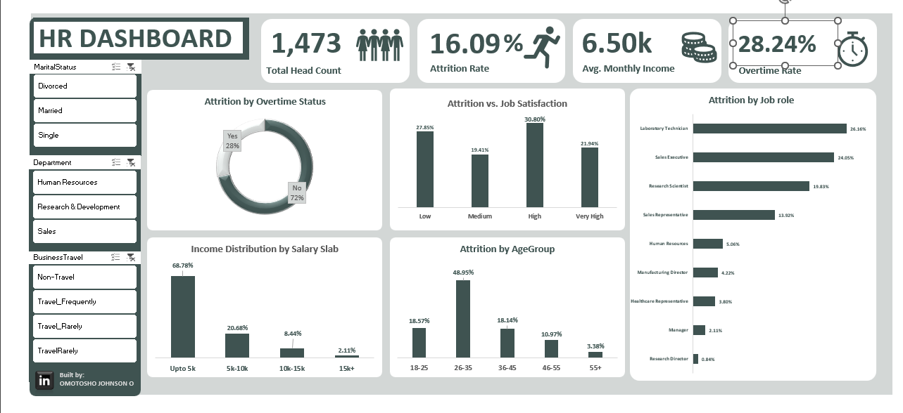

# HR Analytics Dashboard: Employee Retention & Demographics Study

## Project Overview
This project focuses on analyzing an organizational HR dataset to uncover the core behavioral and financial drivers behind employee attrition. Using Microsoft Excel, raw workforce records were audited, deduplicated, and transformed into a centralized data model. This data model powers a highly interactive, executive-tier dashboard UI that allows stakeholders to dynamically diagnose flight risks across different demographics, departments, and operational profiles.

## Key Findings & Business Insights (Baseline Metrics)
The dashboard reveals critical structural patterns behind why employees depart the organization:
* **The Low-Salary Catalyst:** Financial constraints are a dominant driver of turnover; **68.78%** of all corporate attrition is heavily concentrated within the lowest salary tier (**Upto 5k**).
* **Demographic Hotspots:** Young to mid-career professionals are the most vulnerable segment, with the **26–35 age group** accounting for nearly half (**48.95%**) of total departures.
* **Operational Flight Risks:** Departures are heavily dominated by technical and commercial execution roles. **Laboratory Technicians (26.16%)** and **Sales Executives (24.05%)** combined account for over half of all organizational turnover.
* **The Satisfaction Paradox:** Interestingly, **30.80%** of employees who left reported **High** job satisfaction. This indicates that cultural alignment alone is insufficient; external variables such as compensation limits or excessive workloads are overriding positive day-to-day work experiences.

## Core KPI Specifications
The high-level card block layout establishes an unfiltered corporate baseline across 1,473 verified employee profiles:
* **Total Head Count:** `1,473` 
* **Attrition Rate:** `16.09%` (237 total departures)
* **Avg. Monthly Income:** `$6,505.00` (`6.50k`)
* **Overtime Rate:** `28.24%` (Reflecting global organizational overtime exposure)

## Dataset Structure & Scope
The analytical engine processes 38 distinct employee dimensions, categorized into:
* **Workforce Demographics:** Age, AgeGroup, Gender, MaritalStatus, EducationField
* **Operational Attributes:** Department, JobRole, JobLevel, YearsAtCompany, OverTime, BusinessTravel
* **Compensation Frameworks:** MonthlyIncome, SalarySlab, PercentSalaryHike
* **Human Capital Sentiments:** JobSatisfaction, EnvironmentSatisfaction, PerformanceRating, WorkLifeBalance

## Steps & Methodology

### 1. Advanced Data Cleaning & Integrity Audits
* Transformed raw, unformatted CSV records into a structured Excel Data Table (`HR_Data`).
* Conducted a rigorous data deduplication audit, identifying and removing 7 duplicate records to bring the true row count to **1,473**.
* Isolated structural inconsistencies in text strings (e.g., handling variations between `Travel_Rarely` and `TravelRarely` within the Business Travel attribute).
* Resolved missing data attributes within the `YearsWithCurrManager` field to preserve reporting integrity.

### 2. Back-End Calculation Architecture
* Deployed an independent calculation and helper-cell layer using logic formulas (`COUNTIF`, `AVERAGE`, `GETPIVOTDATA`) to feed information seamlessly into floating text box objects.
* Isolated the **Overtime Rate KPI** from individual chart pivot constraints, ensuring it properly displays the macro organizational overtime exposure rate (**28.24%**) rather than sub-filtered segments.

### 3. Dynamic Visual Engineering
* **UI/UX Cleanliness:** Eliminated default spreadsheet gridlines and designed a modern corporate canvas utilizing independent content cards, a unified slate palette, and contextual vector icon integrations.
* **Symmetry & Sorting:** Manually configured chart categories to display sequentially (Job Satisfaction scaled from Low to Very High) and chronologically (Age Groups ordered sequentially from 18-25 up to 55+) to ensure seamless readability for executive leadership.
* **Global Interactivity Control:** Wired high-impact vertical Slicers (**MaritalStatus**, **Department**, and **BusinessTravel**) across all background summaries via cross-pivot **Report Connections**, enabling a fully synchronous, multi-chart filtering user experience.

## Final Dashboard Preview

## How to Interact with the Project
1. Clone or download the `HR_Analytics_Dashboard.xlsx` file from this repository.
2. Open the file in Microsoft Excel (Desktop app optimized).
3. Utilize the Slicers panel on the left sidebar to isolate specific operational combinations. Click buttons like **"Travel_Frequently"** or **"Single"** to watch the entire dashboard canvas adjust its metrics instantly.
